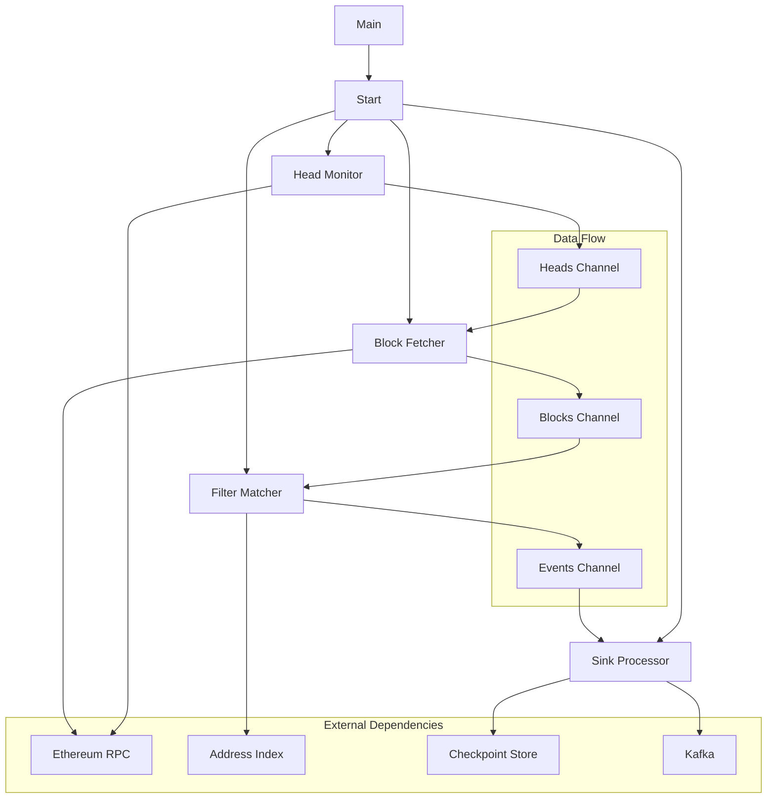
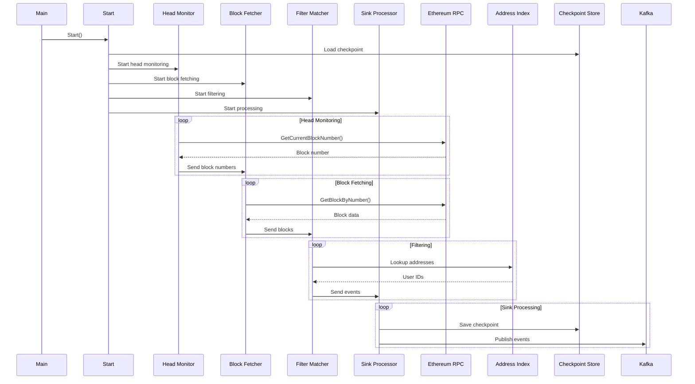

# De-Crypto

# Important Info

I kept the system as simple as possible. I didn't include structured logs or REST endpoints (although I could have added at least a `/health` endpoint so Kubernetes could check if the service is UP). In short, I followed the guidelines and didn't spend too much time on these improvement-oriented implementations. Also I didnt create a start_block env var to start, if you want to start from a recent block you just need to change the checkpoint file in `./data/checkpoint`.

I created 3 json files with addressess, yuo can change the env var `ADDRESS_FILE`to choose how you want to use.

## HowTo

Run:
```
go run cmd/main.go
```

Test:
```
make test-cov
```

Docker:
```
make up
make logs
make kafka-consumer
make down
```


## High Level Overview



## Sequence Diagram



## Kafka

I created a simple implementation of kafka publisher in docker, to see the events you need to create a consumer.

```
	docker exec -it kafka /opt/kafka/bin/kafka-console-consumer.sh \
		--topic de-crypto-events \
		--bootstrap-server kafka:9092 \
		--from-beginning
```

## Handle edge cases

### Retries

In cases of a total system crash, a checkpoint mechanism has already been implemented so that, when the system restarts, it reads the last checkpoint and resumes processing from that point. To avoid duplication, for example, if the crash occurs after an event has been sent but before the checkpoint is saved, an idempotency key strategy would be used, which could be the transactionHash+userId. The destination system would validate the idempotency key and recognize that it is a duplicate event. Also we need to implement a DLQ,or persits in local disk, to save messages when the broker is down.

For cases of network latency or service degradation, I would implement circuit breakers and exponential backoff with jitter. For errors that should not be retried, the system would simply return the error to the caller.

For 429 (Too many requests) that we can get from RPC providers, I would implement an adaptive throttle to limit the requests and cool down when necessary.

### Reorg

To handle block reorganizations (reorgs), I would implement a sliding block validation window that only considers blocks as valid and confirmed in the canonical chain if all parentHashes within the window are correct. For example, with a 10-block window, a block would only be marked as confirmed if all 10 blocks in that window have valid parentHashes and no conflicting blockHash already stored, if an older block with the same height but a different hash exists, it must be discarded and replaced with the new one. The window would be sliding, continuously validating the most recent blocks, and whenever a parentHash mismatch is detected, the system would trigger a reorganization starting from that block. This process would be managed by a dedicated worker (ReorgValidator or something) positioned between the BlockFetcher and the FilterMatcher.

### Observability

I would also implement observability systems to generate metrics and trigger alerts about the systems behavior, allowing us to take preventive rather than reactive actions.